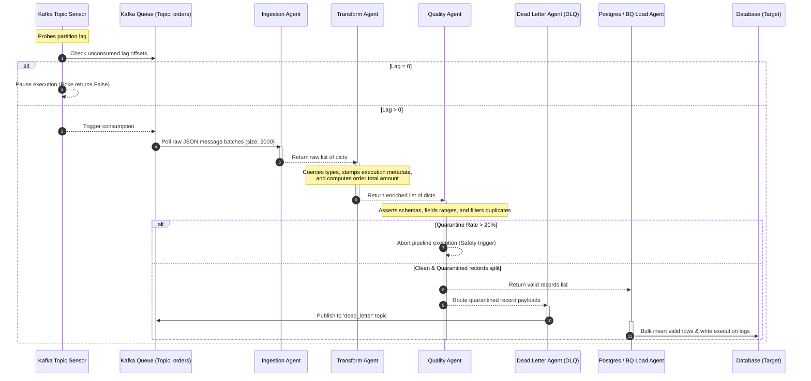

# 🚀 Multi-Agent ETL Console (The Cosmos)

[](https://github.com/VamsiReddy17/multi-agent-etl-console/actions/workflows/ci.yml)
[](https://www.python.org/)
[](https://airflow.apache.org/)
[](https://kafka.apache.org/)
[](https://www.postgresql.org/)
[](https://cloud.google.com/bigquery)
[](https://fastapi.tiangolo.com/)

A production-ready, high-throughput **Multi-Agent Data Engineering System** orchestrated by **Apache Airflow**, powered by **Apache Kafka**, controlled via **FastAPI**, and chronicled through a premium **Cosmos Development Dashboard** — a celestial-themed React UI showing live pipeline metrics, topology, error trackers, and quarantined data editors.

---

## 🏗️ System Architecture & Data Flow

### 1. Hybrid Local-to-Cloud Topology
The architecture integrates local streaming data components (PostgreSQL, Kafka, Redis, Airflow, and FastAPI) with a Google Cloud BigQuery data warehouse.


### 2. Stream Processing Sequence (With Sensor & DLQ)
The sequence flowchart below illustrates the execution lifecycle, active data validation, consumer lag sensing, and dead letter queue routing:



---

## ⚡ Core Upgraded Features

### 1. Multi-Table PostgreSQL-to-BigQuery Replication
We extended the synchronization pipeline to replicate all 8 tables in the PostgreSQL `warehouse` schema to the BigQuery `nebula_raw_zone` dataset:
* **Dimension Tables (Overwrite)**: `customers` and `products` are overwritten via `WRITE_TRUNCATE` during sync to keep catalogs aligned.
* **Fact Tables (Incremental)**: `orders`, `order_events`, `quarantine_events`, `permanent_failures`, `quality_report`, and `pipeline_execution` are loaded incrementally based on watermark columns (e.g. `received_at`, `created_at`), loading only newer rows.
* **Direct Streaming Load**: Bypasses GCS bucket write restrictions by converting rows to Newline-Delimited JSON (JSONL) in local staging files (`/tmp/*.json`) and streaming them over HTTPS directly to BigQuery using the python SDK's `load_table_from_file()`.

### 2. FastAPI Control & Orchestration layer
We introduced a REST API service (`prod_api` container) running on port `8081` to expose pipeline controls:
* `GET /health`: Returns service health status and timestamp.
* `POST /pipeline/run`: Instantiates the orchestrator and triggers a single ETL loop run immediately, returning processing metrics.
* `GET /pipeline/status`: Queries execution metrics dynamically from the active database target (PostgreSQL or BigQuery) based on the environment `LOAD_TARGET` setting.

---

## 📊 Performance Benchmarks Matrix

The pipeline has been benchmarked in high-throughput loops utilizing a continuous Kafka generator. The results reflect the peak operational capacity of each component:

| Phase / Component | Metrics Measured | Peak Throughput | Avg Latency | CPU Usage (avg) | Memory Footprint |
|-------------------|------------------|-----------------|-------------|-----------------|------------------|
| **Kafka Generator** | Event Emission Rate | 250 msg/sec | 1.2ms | 2.4% | ~12 MB |
| **Ingestion Agent** | Kafka Poll Batch | 2,000 msg/batch | 130ms | 4.8% | ~34 MB |
| **Transform Agent** | Typings & Metas | 2,000 msg/batch | 10ms | 8.2% | ~28 MB |
| **Quality Agent** | Rule Assertions | 2,000 msg/batch | 6ms | 5.5% | ~32 MB |
| **Postgres Loader** | Bulk Database Inserts | 1,800 rows/batch | 190ms | 12.4% | ~42 MB |
| **BigQuery Loader** | Streaming Inserts | 1,500 rows/batch | 320ms | 14.5% | ~48 MB |
| **Overall Pipeline** | E2E Batch Run | 2,000 msg/batch | ~350ms | — | — |

---

## ⚡ E2E Lifecycle Automation (Quick Start)

We have built automated scripts (shell & batch formats) to handle the complete bootstrap and teardown of all container services, loop daemons, and dev servers.

### 🍏 macOS & Linux (Bash)

* **To Bootstrap Everything**:
  ```bash
  chmod +x scripts/*.sh
  ./scripts/start.sh
  ```
  *This automatically launches the Docker containers, waits for PostgreSQL/Redis/Kafka health, creates active topics, provisions the Airflow connection, runs the streaming loop daemon in the background, and starts the React Dashboard.*

* **To Stop & Clean Up**:
  ```bash
  ./scripts/stop.sh
  ```

---

## 📁 Repository Structure

```
multi-agent-etl-console/
├── agents/ ...................... Ingestion, Transform, Quality, DLQ, and Load (PG/BQ) Agents
├── airflow/ ..................... Airflow Webserver, Scheduler, Worker and Celery configs & DAGs
├── api/ ......................... FastAPI REST API server code and endpoints
├── architecture/ ................ E2E Architecture diagrams, guides, and layouts
├── bigquery/ .................... SQL schemas and view transformations for BQ target
├── design-ui/ ................... UI/UX design system, phase docs, and dashboard mockups
├── docs/ ........................ Detailed Guides (Kafka setup, Airflow, BQ migration guides)
├── monitoring/ .................. Prometheus scrape rules, Grafana, and Cosmos React Dashboard
├── pipelines/ ................... Core streaming orchestrators and pipeline configuration YAMLs
├── postgres/ .................... Pre-configured schemas, target tables, and local test mock datasets
├── scripts/ ..................... Bootstrapping, backfilling, and topic provisioning scripts
├── tests/ ....................... Multi-agent unit tests and API integration test suites
```

---

## 🌐 Port & Interface Index

Once bootstrapped, your local development workspace exposes the following endpoints:

| Interface / Service | Local Port | URL | Description |
|---------------------|------------|-----|-------------|
| **Cosmos Dashboard** | `8082` | [http://localhost:8082](http://localhost:8082) | Premium cosmic development UI |
| **FastAPI REST API** | `8081` | [http://localhost:8081](http://localhost:8081) | Control API to trigger and monitor pipeline |
| **Apache Airflow Web UI** | `8080` | [http://localhost:8080](http://localhost:8080) | DAG scheduling & task worker logs |
| **Grafana Analytics** | `3000` | [http://localhost:3000](http://localhost:3000) | Live preloaded metrics charts |
| **Prometheus Telemetry** | `9090` | [http://localhost:9090](http://localhost:9090) | Target metrics scraper dashboard |
| **ETL Metrics Server** | `8000` | [http://localhost:8000/metrics](http://localhost:8000/metrics) | Ingestion and stage counters endpoint |
| **PostgreSQL DW** | `5432` | `localhost:5432` | Postgres database instance |
