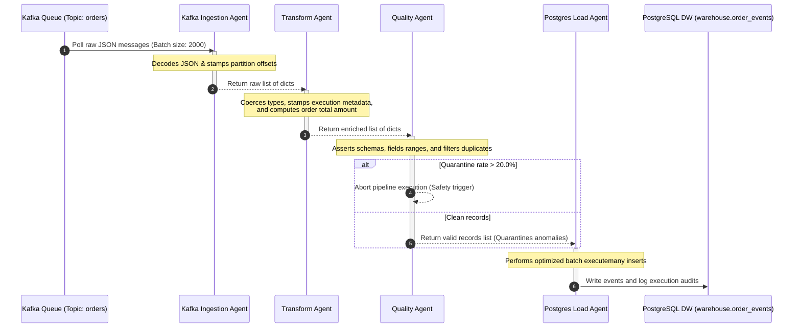
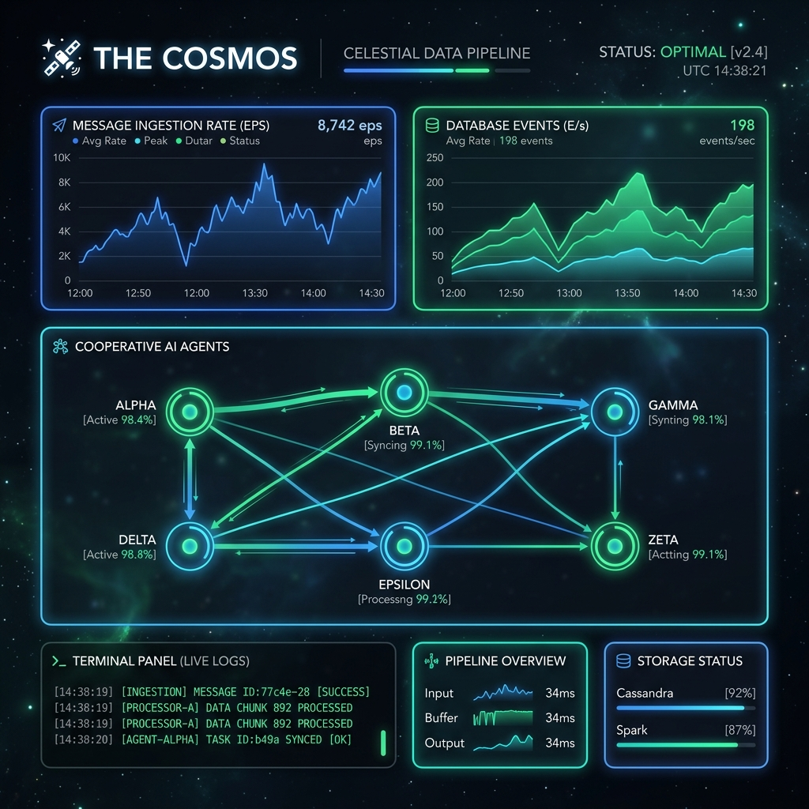

# 🚀 Multi-Agent ETL Console

[](https://github.com/VamsiReddy17/multi-agent-etl-console/actions/workflows/ci.yml)
[](https://www.python.org/)
[](https://airflow.apache.org/)
[](https://kafka.apache.org/)
[](https://www.postgresql.org/)

A production-ready, high-throughput **Multi-Agent Data Engineering Pipeline** orchestrated by **Apache Airflow**, powered by **Apache Kafka**, and chronicled through a premium **Cosmos Development Dashboard** — a celestial-themed React UI that tells the story of every session, bug, and fix. 

This system coordinates four specialized agents working sequentially to ingest, transform, validate, and load real-time Kafka event streams into a PostgreSQL Data Warehouse.

---

## 🏗️ System Architecture & Data Flow

### 1. Cooperative Agent Topology
The pipeline leverages cooperative AI agent patterns to divide labor across discrete streaming stages:


### 2. Event Processing Sequence Loop
The sequence flowchart below illustrates the exact execution lifecycle and communication protocol between Kafka topic queues, the 4 active agents, and the target database:



### 3. The Cosmos — Development Chronicle Dashboard
A premium, celestial-themed React.js single-page application presenting the entire development journey across **7 interactive views**: The Nebula (session history timeline), The Asteroid Belt (errors & bug tracker), The Pulsar Log (narrative development log), The Solar Core (pipeline metrics & telemetry), The Constellation (live data flow canvas), The Orion Array (system topology & health), and The Event Horizon (anomaly isolation hub).



---

## 📊 Performance Benchmarks Matrix

The pipeline has been benchmarked in high-throughput loops utilizing a continuous Kafka generator. The results reflect the peak operational capacity of each component:

| Phase / Component | Metrics Measured | Peak Throughput | Avg Latency | CPU Usage (avg) | Memory Footprint |
|-------------------|------------------|-----------------|-------------|-----------------|------------------|
| **Kafka Generator** | Event Emission Rate | 250 msg/sec | 1.2ms | 2.4% | ~12 MB |
| **Ingestion Agent** | Kafka Poll Batch | 2,000 msg/batch | 130ms | 4.8% | ~34 MB |
| **Transform Agent** | Typings & Metas | 2,000 msg/batch | 10ms | 8.2% | ~28 MB |
| **Quality Agent** | Rule Assertions | 2,000 msg/batch | 6ms | 5.5% | ~32 MB |
| **Postgres Loader** | Bulk Database Inserts | 1,800 rows/batch | 190ms | 12.4% | ~42 MB |
| **Overall Pipeline** | E2E Batch Run | 2,000 msg/batch | ~350ms | — | — |

> [!TIP]
> Connection pooling and psycopg2 `executemany` allow the Postgres Load Agent to ingest **over 280 rows per second** into the data warehouse, comfortably maintaining a zero lag state.

---

## 🔀 Unified Agent Communication Protocol

All agents exchange information using a strictly structured JSON payload contract. Every step parses the outputs of the previous agent:

```json
{
  "status": "success | skipped | error",
  "data": [
    {
      "order_id": 401,
      "customer_id": 3,
      "product_id": 2,
      "quantity": 2,
      "amount": 59.98,
      "event_type": "order_placed",
      "received_at": "2026-06-08T05:30:00Z"
    }
  ],
  "rows": 1,
  "duration_ms": 12.5,
  "errors": [],
  "error_message": null,
  "agent": "KafkaIngestionAgent"
}
```

---

## ⚡ E2E Lifecycle Automation (Quick Start)

We have built automated scripts (shell & batch formats) to handle the complete bootstrap and teardown of all container services, loop daemons, and dev servers.

### 🍏 macOS & Linux (Bash)

* **To Bootstrap Everything**:
  ```bash
  chmod +x scripts/*.sh
  ./scripts/start.sh
  ```
  *This automatically launches the Docker containers, waits for PostgreSQL/Redis/Kafka health, creates active topics, provisions the Airflow connection, runs the streaming loop daemon in the background, and starts the React Dashboard.*

* **To Stop & Clean Up**:
  ```bash
  ./scripts/stop.sh
  ```

### 🪟 Windows (Batch CMD)

* **To Bootstrap Everything**:
  ```cmd
  scripts\start.bat
  ```

* **To Stop & Clean Up**:
  ```cmd
  scripts\stop.bat
  ```

---

## 📁 Repository Structure

```
multi-agent-etl-console/
├── agents/ ...................... Specialized Python Ingestion, Transform, Quality & Load Agents
├── airflow/ ..................... Airflow Webserver, Scheduler, Worker and Celery configs & DAGs
├── architecture/ ................ E2E Architecture diagrams, flow definitions, and layout mockups
├── design-ui/ ................... UI/UX design system, phase docs, mockups, and industry research
├── docs/ ........................ Detailed Guides (Kafka setup, Airflow integrations, cloud scale)
├── monitoring/ .................. Prometheus scrape rules, Grafana dashboards, and Cosmos React Dashboard
├── pipelines/ ................... Core streaming orchestrators and pipeline configuration YAMLs
├── postgres/ .................... Pre-configured schemas, target tables, and local test mock datasets
├── scripts/ ..................... Bootstrapping, health-checking, and topic provisioning scripts
├── sql/ ......................... Data Warehouse counting scripts and schema audit utilities
├── tests/ ....................... Multi-agent unit tests and E2E integration test suites
└── wip/ ......................... AI Agent Knowledge Base, completion lists, and session logs
```

---

## 🌐 Port & Interface Index

Once bootstrapped, your local development workspace exposes the following endpoints:

| Interface / Service | Local Port | URL | Description |
|---------------------|------------|-----|-------------|
| **Cosmos Dashboard** | `5173` | [http://localhost:5173](http://localhost:5173) | Premium cosmic development chronicle UI |
| **Apache Airflow Web UI** | `8080` | [http://localhost:8080](http://localhost:8080) | DAG scheduling & loop logs (`airflow/airflow`) |
| **Grafana Analytics** | `3000` | [http://localhost:3000](http://localhost:3000) | Live preloaded metrics charts (`admin/admin`) |
| **Prometheus Telemetry** | `9090` | [http://localhost:9090](http://localhost:9090) | Target metrics scraper dashboard |
| **ETL Metrics Server** | `8000` | [http://localhost:8000/metrics](http://localhost:8000/metrics) | Ingestion and stage counters endpoint |
| **PostgreSQL DW** | `5432` | `localhost:5432` | Postgres database instance (`postgres/postgres_password`) |

---

## 🧠 AI Agent Knowledge Base

If you are developing this project using an AI coding agent, read **[AGENT_KNOWLEDGE.md](wip/AGENT_KNOWLEDGE.md)** before modifying any packages. It contains post-mortem analyses of dependency mismatches (connexion, pendulum, flask-session, sqlalchemy) to prevent builds from failing.

---

## 📜 Community & Support

* Read **[COSMOS.md](COSMOS.md)** — the complete development narrative chronicle.
* Check out our **[CONTRIBUTING.md](CONTRIBUTING.md)** guidelines to start submitting code.
* Refer to our **[SECURITY.md](SECURITY.md)** to report vulnerabilities.
