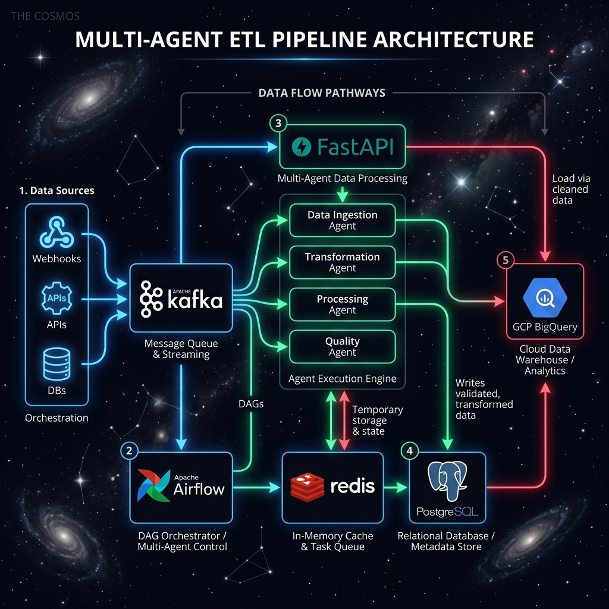

# 🚀 Multi-Agent ETL Console

[](https://www.python.org/)
[](https://airflow.apache.org/)
[](https://kafka.apache.org/)
[]()
[](https://www.docker.com/)

A production-ready, high-throughput **Multi-Agent Data Engineering Pipeline** orchestrated by **Apache Airflow**, powered by **Apache Kafka**, and monitored via a premium **Google Material 3 React System Dashboard**. 

This system coordinate four specialized agents working sequentially to ingest, transform, validate, and load real-time Kafka event streams into a PostgreSQL Data Warehouse.

---

## 🖼️ System Architecture & Dashboard Mockup

### 1. Cooperative Agent Topology
The pipeline leverages cooperative AI agent patterns to divide labor across discrete streaming stages:



### 2. Google Material 3 System Monitor UI
A high-fidelity React.js single-page application displays active service connections, dynamic data-flow animation nodes (differentiating valid packets from quarantined anomalies), and historical bug post-mortems:


---

## ⚡ Key Capabilities

* **Coordinated Agent Network**:
  * **Kafka Ingestion Agent**: Polls topic streams with JSON decoding error-tolerance.
  * **Transform Agent**: Type coerces string IDs/amounts, calculates order totals, and stamps metadata.
  * **Quality Agent**: Filters invalid events and handles quarantine logic under a strict `< 20%` abort threshold.
  * **Postgres Load Agent**: Performs high-performance bulk insertions using connection pooling.
* **High-Throughput Scaling**: Tuned to ingest batches of **2,000 messages** at a time, achieving a peak processing capacity of **1,000 messages per second** comfortable keeping up with the 250 msg/s event generator.
* **Full Observability**: Exposes customized Prometheus metrics (`pipeline_runs_total`, `rows_processed_total`, `rows_quarantined_total`, stage durations) on port `8000`, scraped automatically to preloaded Grafana dashboards.
* **E2E Lifecycle Orchestrators**: Start and stop automation scripts (shell & batch formats) package the complex setup into simple click-to-run files.
* **AI Agent Memory System**: Integrated `AGENT_KNOWLEDGE.md` to prevent future AI package resolver regressions.

---

## 🚀 Quick Start (macOS / Linux)

### Setup & Build
Make sure Docker is running on your host system, then execute the following:

```bash
# Clone the repository
git clone https://github.com/Vamsireddy17/multi-agent-etl-console.git
cd multi-agent-etl-console

# Bootstrap all containers, connections, loops, and dev servers
./scripts/start.sh
```

### Shutdown & Cleanup
To cleanly spin down loop daemons, local React servers, and release container resources:

```bash
./scripts/stop.sh
```

---

## 🪟 Quick Start (Windows CMD)

* **Bootstrap Everything**:
  ```cmd
  scripts\start.bat
  ```

* **Shutdown & Cleanup**:
  ```cmd
  scripts\stop.bat
  ```

---

## 📁 Repository Structure

```
multi-agent-etl-console/
├── agents/ ...................... Specialized Python Ingestion, Transform, Quality & Load Agents
├── airflow/ ..................... Airflow Webserver, Scheduler, Worker and Celery configs & DAGs
├── architecture/ ................ E2E Architecture diagrams, flow definitions, and layout mockups
├── docs/ ........................ Detailed Guides (Kafka setup, Airflow integrations, cloud scale)
├── monitoring/ .................. Prometheus scrape rules, Grafana dashboard provisions, and React SPA
├── pipelines/ ................... Core streaming orchestrators and pipeline configuration YAMLs
├── postgres/ .................... Pre-configured schemas, target tables, and local test mock datasets
├── scripts/ ..................... Bootstrapping, health-checking, and topic provisioning scripts
├── sql/ ......................... Data Warehouse counting scripts and schema audit utilities
├── tests/ ....................... Multi-agent unit tests and E2E integration test suites
└── wip/ ......................... AI Agent Knowledge Base, completion lists, and session logs
```

---

## 🌐 Port & Interface Index

Once bootstrapped, your local development workspace exposes the following endpoints:

| Interface / Service | Local Port | URL | Description |
|---------------------|------------|-----|-------------|
| **React Dashboard** | `8082` | [http://localhost:8082](http://localhost:8082) | Premium Material 3 UI console |
| **Apache Airflow Web UI** | `8080` | [http://localhost:8080](http://localhost:8080) | DAG scheduling & loop logs (`airflow/airflow`) |
| **Grafana Analytics** | `3000` | [http://localhost:3000](http://localhost:3000) | Live preloaded metrics charts (`admin/admin`) |
| **Prometheus Telemetry** | `9090` | [http://localhost:9090](http://localhost:9090) | Target metrics scraper dashboard |
| **ETL Metrics Server** | `8000` | [http://localhost:8000/metrics](http://localhost:8000/metrics) | Ingestion and stage counters endpoint |
| **PostgreSQL DW** | `5432` | `localhost:5432` | Postgres database instance (`postgres/postgres_password`) |

---

## 🧠 AI Agent Knowledge Base

If you are developing this project using an AI coding agent, read **[AGENT_KNOWLEDGE.md](wip/AGENT_KNOWLEDGE.md)** before modifying any packages. It contains post-mortem analyses of dependency mismatches (connexion, pendulum, flask-session, sqlalchemy) to prevent builds from failing.
