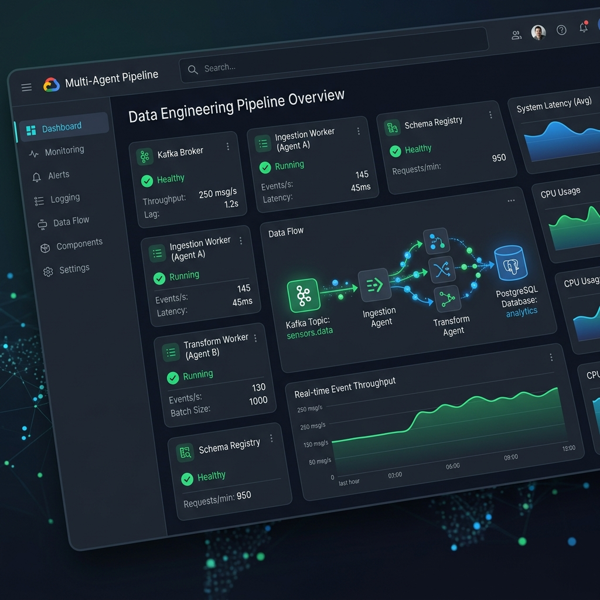

# Phase 1 — Google Material 3 System Monitor UI

> **Status:** ✅ Completed → Superseded by Phase 2  
> **Timeline:** May 20 – June 8, 2026  
> **Design System:** Google Material Design 3

---

## Overview

The initial dashboard was a **Google Material 3** single-page application built with React.js and Vite. It served as the system monitoring console for the Multi-Agent ETL Pipeline, displaying service status, live metrics, data-flow animations, and bug post-mortems.

## Design Philosophy

| Principle | Implementation |
|-----------|---------------|
| **Material You** | Card-based layouts with M3 elevation shadows and rounded corners |
| **Color System** | Light theme with standard Material palette (blue primary, red error, green success) |
| **Typography** | System default fonts (no custom web fonts) |
| **Layout** | Tab-based single-column layout |
| **Interactivity** | Basic tab switching, no progressive disclosure |

## Component Inventory

1. **Service Status Grid** — 13 service cards showing UP/DOWN status with toggle switches
2. **Metrics Dashboard** — 4 KPI tiles (rows loaded, throughput, quarantine rate, pipeline runs)
3. **Data Flow Animation** — Horizontal pipeline with moving particle dots (green = valid, red = quarantined)
4. **Quarantine Inspector** — Table of flagged records with JSON payload viewer
5. **Bug Timeline** — Scrollable list of 9 bugs with expandable details
6. **Terminal Log Feed** — Simulated log output with color-coded severity
7. **Database Inspector** — Tab-based table viewer for warehouse tables

## Mockup

## Limitations Identified

| Issue | Impact |
|-------|--------|
| Generic styling | Didn't stand out from standard admin templates |
| No narrative structure | Development history was a flat list, not a story |
| Light theme default | Inconsistent with modern developer tool conventions |
| No custom typography | Felt generic, not branded |
| Flat information hierarchy | All information presented at same visual weight |
| No micro-animations | Interface felt static and lifeless |

## Lessons for Phase 2

1. **Developer tools should be dark by default** — Light themes create glare during long sessions
2. **Data dashboards need narrative context** — Numbers without story don't stick
3. **Custom typography creates brand identity** — System fonts feel anonymous
4. **Progressive disclosure reduces cognitive load** — Show less, reveal on demand
5. **Micro-animations create perceived performance** — Motion makes interfaces feel responsive
