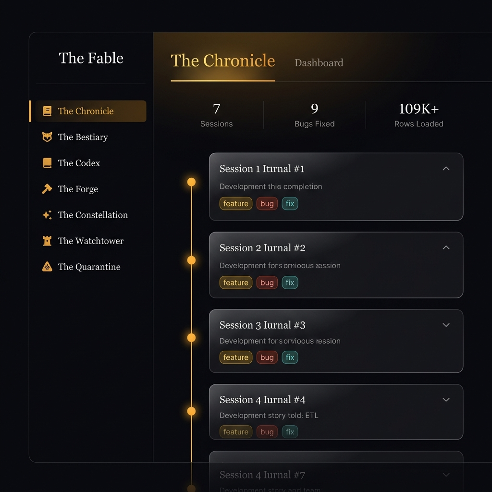

# Phase 3 — The Observatory: Intelligence Layer

> **Status:** ✅ Active (Implemented)  
> **Timeline:** June 17, 2026  
> **Design System:** Fable Design System + Observatory Intelligence Extensions

---

## Overview

Phase 3 adds an **intelligence layer** to The Fable dashboard, inspired by Linear's keyboard-first design, Datadog's deep search, and Vercel's instant feedback patterns. The focus is on **power user productivity**, **accessibility compliance**, and **micro-feedback systems**.

## Features Implemented

### 1. ⌘K Command Palette (Linear-Inspired)
**Trigger:** `Cmd+K` (macOS) / `Ctrl+K` (Windows)

A full-screen search overlay that indexes the entire application:
- **7 Navigation Targets** — Jump to any tab instantly
- **2 Actions** — Toggle simulation, switch live/sim mode
- **7 Sessions** — Jump to and auto-expand specific chronicle chapters
- **9 Bugs** — Navigate directly to a bestiary entry
- **13 Services** — Jump to a specific service in the Watchtower

**Interaction:**
- `↑ ↓` arrow keys navigate results
- `Enter` selects the active item
- `Esc` closes the palette
- Click outside to dismiss
- Results grouped by type: NAVIGATE → ACTIONS → SESSIONS → BUGS → SERVICES
- Active item highlighted with amber left border

### 2. 🔢 Keyboard Shortcuts
| Key | Action |
|-----|--------|
| `1` | Go to The Chronicle |
| `2` | Go to The Bestiary |
| `3` | Go to The Codex |
| `4` | Go to The Forge |
| `5` | Go to The Constellation |
| `6` | Go to The Watchtower |
| `7` | Go to The Quarantine |
| `⌘K` | Open Command Palette |
| `Esc` | Close Command Palette |

- Number keys only fire when no `<input>` or `<textarea>` is focused (prevents conflicts with search bars)
- Keyboard shortcut hints (`kbd-hint`) appear in the sidebar on hover

### 3. 🔔 Toast Notification System
Non-intrusive bottom-right toast notifications with:
- **4 severity variants:** `success` (emerald), `error` (crimson), `warning` (amber), `info` (sapphire)
- **Auto-dismiss:** 3.5-second lifetime with fade-out animation
- **Stacked layout:** Multiple toasts stack vertically with column-reverse
- **Semantic icons:** CheckCircle, AlertTriangle, Info icons per variant
- **Animated entrance:** Slide-in from right (300ms ease-out)

Toasts fire on:
- Tab navigation via keyboard shortcuts
- Command Palette selections
- Any action triggered via the palette

### 4. 📊 Sparkline Mini-Charts
Added to all 4 Forge metric tiles (inspired by Grafana's inline metric sparklines):
- **20-point trailing history** per metric
- **Live updates** every 2 seconds when simulation is running
- **Color-matched bars:** Blue (loaded), Green (throughput), Red (quarantine), Amber (runs)
- **Smooth transitions:** 400ms ease-out height animation on each bar

### 5. 🔍 In-Tab Search Filters
**Chronicle Tab:**
- Search bar filters sessions by title and summary text
- Appears between hero stats and timeline

**Bestiary Tab:**
- Search bar filters bugs by title and description
- Works in combination with severity filter chips (AND logic)

### 6. ♿ Accessibility: `prefers-reduced-motion`
Added CSS media query that:
- Disables all CSS animations and transitions (duration → 0.01ms)
- Stops particle flow, orb pulse, and timeline dot animations
- Removes command palette and toast entrance animations
- Ensures the UI is fully functional without motion

### 7. 🖨️ Print Styles
Added print-specific CSS that:
- Hides sidebar, topbar, toasts, and command palette
- Switches to single-column white background layout
- Removes glass-morphism and shadows for clean print output

## Technical Implementation

### New Dependencies
- `Search`, `Command`, `Info` icons from lucide-react (already installed)
- `useCallback` hook from React (for memoized toast helper)

### New State Variables
```javascript
cmdOpen, cmdQuery, cmdActiveIdx  // Command Palette
toasts                           // Toast notification queue
sparkHistory                     // 20-point sparkline arrays (4 metrics)
chronicleSearch, bestiarySearch  // In-tab search filters
```

### New CSS Sections (8 sections added)
| Section | Lines | Purpose |
|---------|-------|---------|
| 24. Command Palette | ~130 | Full overlay, input, results, footer |
| 25. Toast System | ~50 | Container, variants, animations |
| 26. Sparklines | ~25 | Bar chart mini-visualization |
| 27. Kbd Hints | ~20 | Sidebar keyboard shortcut badges |
| 28. Search Bar | ~30 | In-tab filter input |
| 29. Enhanced Metrics | ~15 | Trend indicators |
| 30. Reduced Motion | ~20 | Accessibility media query |
| 31. Print Styles | ~25 | Print-friendly layout |

## Mockup



## What's Next (Phase 4 Ideas)

Based on continued industry research:
1. **AI Chat Interface** — "Ask the pipeline" natural language queries via Gemini
2. **Flame Charts** — Execution breakdown for each pipeline stage
3. **Multi-user Cursors** — Collaborative debugging sessions (Figma-style)
4. **Light Theme** — Full `prefers-color-scheme` support with manual toggle
5. **Notification Center** — Persistent notification history with read/unread states
